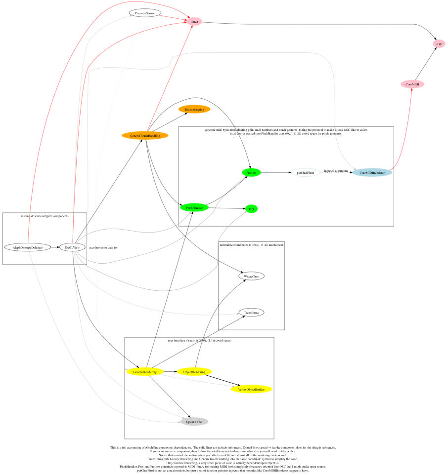

AlephOne
========

This project is lessons learned from Mugician and Geo Synth.  I have no idea if this code will literally be released as an instrument.  But it's a lab rat designed to produce clean code modules that are very isolated and heavily tested.  As such, I will be resisting any attempts to let the modules start to build up unnecesary dependencies and complexity.

After only a few weeks of effort, it is better than Geo in a lot of ways (almost entirely in the Fretless module).

http://www.youtube.com/watch?v=ZGSZBsxYMfI

Conventions
-----------

Because the point of this project is to start building up reuseable components, and try to influence the MIDI standard (as MIDI HD is being defined) as practiced on mobile devices, I follow rules like this where I can:

* Most modules are DETERMINISTIC BUFFER GENERATORS that INVOKE CALLBACKS with no dependencies on anything else.  The point of this is that unit testing becomes very easy, because dependencies can be mocked for the test.  This includes OpenGL rendering and MIDI code.
* No includes in either the header or in the implementation of the module is ideal.  If you have dependencies, injecting function pointers that use predefined types through the interface is usually sufficient.

* I favor pure C code everywhere that it is possible, because requiring C++ or ObjectiveC can be a pretty invasive requirement where it's not already justified.

* Try to avoid including headers in headers.  That is, keep dependencies private if at all possible.  

* Avoid declaring more than functions in header files.  If you must declare a pointer to a type that you define, try to keep the definition internal and provide functions to keep the structure opaque.

* Avoid having modules have *any* static variables.  Fretless adheres to this, and because of it, we can run multiple instances of it for the cases where different settings on the MIDI generator necessitate that different MIDI streams be generated.  It's not quite like emulating object oriented programming, because even the malloc is a function that's passed in.  A TODO item is to get all major modules to have all state into an allocated structure in which every byte is initially zeroed out.  This will help to ensure that we get completely deterministic behavior, to the point that you should be able to run the same invocations twice against it and be able to do a string comparison on the memory and have them be equal.  This is important in Fretless because its disaster recovery mechanism is to do a soft reboot by re-initializing if it discovers a violated assertion then reaches a safe state to recover from (ie: all fingers up).  The strategy there is to log failures, and restart the module when they happen.  Even correct code can get into a bad state because of buffer overruns from a different buggy module.

* The main point is not so much the information hiding or the syntax of object oriented programming, but keeping dependencies to a minimum.  In other words, expect somebody faced with pulling in a bunch of your code to use a little bit of it to simply balk and go write his own code.  Object Oriented code can frequently do the opposite of reuse because of dependency proliferation, from requiring a more baroque language runtime than what may already be in use to having the type system cause transitive dependencies to pull in far too much code.  (This is also why I favor function pointers and avoid structures as much as possible.  It's easier to match up with a pair of compatible functions from a project than it is to impose an interface declaration that it must meet.  Essentially it is duck typing, and when you don't have functions that meet the interface you provide wrapped versions of them.)

* Inject logging functions into modules.  Do not include libraries all over the place in order to log things.  Not only is logging something that is pervasive but spreads throughout the code, but it's also something that will be different every time you try to assemble an application out of a bunch of modules that you get from different places.  If you want to include a module as it is without having to change it, your best bets are to wrap up some functions to have the expected interfaces and inject them.  (ie: submit a logging function with an interface that looks like printf, or literally submit printf if that is efficient, or a vacuous function to supress the logging - where this is sufficient because strings are only built in the logger if it does something with its args, etc.)

 

Main Components
---------------

These are the main components roughly in order from most portable to least portable:

* Fretless -- A totally isolated MIDI library. This library is the essence of what makes Mugician and Geo special, and would allow almost anybody to painlessly write such an app (so long as it talks to MIDI of course).  It is designed as a portable C buffer generator of MIDI data.  All dependencies are injected, and all types are built-in types.  All of this is necessary because one goal of this library is to standardize how Fretless MIDI is done; to fix the MIDI standard for touch-screens essentially.  SampleWiz and ThumbJam recognize this MIDI, and Geo emits it.  The plan is to get this code very solid, and see if we can get many synths to understand this code, and for many controllers to emit it.  That will never work if there are application specific dependencies abound in the code.  This is designed so that almost any app that is using MIDI can start here, even if they have their own plans for all of the other modules.

See the image fretless.png for the legal calling sequence of API methods.  The ".finger" notation simply means that it's a parameter and it has to be the same value from one transition to the next.  It's essentially duplicating states in the diagram without getting into complex combinations that will obscure what's going on.  What's important is that this says at what point it is safe to make calls.
* PitchHandler -- An isolated pitch handling library, that is currently handling the main coordinate system problems as well.  One of the main problems I had with Mugician and Geo is that coordinate systems not done right, spread complexity absolutely everywhere else throughout the code.  This problem starts with the fact that basic things like pitch geometer, touches, and OpenGL windows have different coordinate system conventions by default.  We immediately get out of coordinates to pitches as soon as that is possible.  Where coordinates are necessary, we ensure that this is done so that the coordinate system that will be used by the OpenGL code later on will be identical, so that there is no proliferation of equations throughout the code trying to compensate for the inconsistency.  This module may eventually split as it ties together coordinate systems too tightly with pitch handling proper.  This module will provide the metadata that the OpenGL surfaces will need to actually render.  This means that once the moveable frets and snapping rules are set, OpenGL should be able to run some iterators in this library to figure out how to draw the surface and how to show the touches to the user.

* TouchMaping -- An isolated library for mapping pointers to some kind of touch object to finger identifiers.   

* ControlRegistry -- A library that is being planned.  When bringing in many modules from different code that are isolated, by definition they will not be importing code and conventions from a common location.  But in places where knobs, sliders, and switches are used we can collect these points into a set of controls.  As an example, most libraries will have a get/set function pair for some integer and floating point values.  The library as imported won't have all the information to make a control, but the registry could map the pair up to a function that returns a display name and a string value for the current get value.  In this way, components that simply provide functionality can stay out of the business of exposing parameters in an app specific way.  This should be the job of the application that's assembling the components for its own purposes.

* VertexObjectBuilder -- An isolated library that makes it easy to generate OpenGL objects ahead of time (ie: lines, triangle strips).  It has no dependencies on anything, including no dependencies on OpenGL itself.

* GenericTouchHandling -- This library has a few dependencies on our C libraries, but still doesn't make any references into any ObjectiveC or Apple libraries.  It is the portable parts of code that handle touches going up and down, only assuming that we got some kind of pointer for the touch.

* CoreMIDIRenderer -- The Fretless MIDI API invokes function pointers like putchar/flush to generate MIDI packets.  Either a synthesizer, or a proxy for a synthesizer can implement this interface.  CoreMIDIRenderer is just such a proxy, and only depends on Fretless and CoreMIDI.  The interface is C, but the implementation is Objective-C, and is the first thing in this list that won't be useable on Android for sure (though it's a small piece of code that would have an equivalent there.) It is the simplest implementation of an object that looks like a synthesizer to Fretless.  If we embed an internal sound engine, it should have a similar interface.  Doing things this way yields an incredible number of advantages.  The primary advantage is that it becomes easy to both test MIDI synths locally, and allow for synth engines to be per-patch (sampling based versus subtractive versus just sending the messages on to somewhere else).  Most people wanting to quickly build an app will use this along with Fretless to get the app up and running.

 
